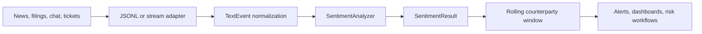

# Architecture

## Components

1. **Ingestion boundary**: the CLI currently consumes newline-delimited JSON. Production adapters can wrap the same `TextEvent` model for queues or APIs.
2. **Analyzer**: `SentimentAnalyzer` applies auditable lexicons for positive indicators, negative indicators, and risk flags.
3. **Streaming state**: `SentimentStream` stores a bounded rolling window per counterparty and exposes snapshots for downstream routing.
4. **Output boundary**: results are JSON-serializable and include both event-level signals and optional rolling snapshots.

## Operational considerations

- Keep source text and generated scores traceable for model-risk review.
- Treat the lexicon as configuration in regulated environments and review changes through normal change-management controls.
- Monitor source-specific false positives, especially around negated risk terms and legal boilerplate.
- Use this baseline as an explainable first pass before adding heavier model-backed scoring.
