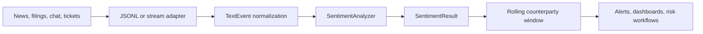

# Architecture

## Components

1. **Ingestion boundary**: the CLI currently consumes newline-delimited JSON. Production adapters can wrap the same `TextEvent` model for queues or APIs.
2. **Risk lexicons**: `lexicons.py` contains weighted category dictionaries, source reliability weights, context suppression patterns, and event type patterns.
3. **Analyzer**: `SentimentAnalyzer` applies weighted evidence, context windows, negation/suppression, uncertainty discounts, source reliability, recency weighting, optional ML blending, and explainable category scores.
4. **Event extraction**: `extraction.py` extracts structured events, monetary values, percentages, actions, and markets from the same text.
5. **Streaming state**: `SentimentStream` stores a bounded rolling window per counterparty and exposes snapshots with rolling averages, volatility, frequency, trend, escalation, top flags, and decayed risk scores.
6. **Output boundary**: results are JSON-serializable and include event-level signals, severity, explanations, structured events, dimension scores, and optional rolling snapshots.

## Operational considerations

- Keep source text and generated scores traceable for model-risk review.
- Treat the lexicon, source weights, suppression patterns, and dimension weights as configuration in regulated environments and review changes through normal change-management controls.
- Monitor source-specific false positives, especially around negated risk terms, systemic-risk language, and legal boilerplate.
- Use this baseline as an explainable first pass before adding heavier model-backed scoring.
